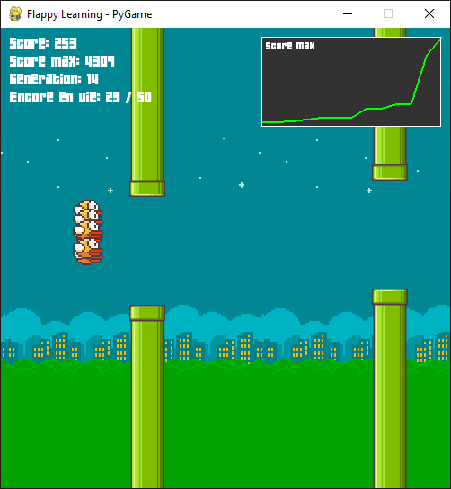
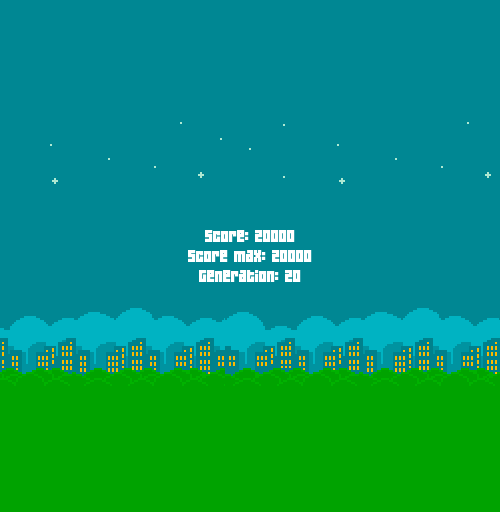

<br>
Implémentation du jeu Flappy Bird où les oiseaux apprennent à jouer grâce à la neuroévolution.
<br>
Génère une population initiale de 50 réseaux de neurones qui contrôlent chacun un oiseau, sélectionne les meilleurs pour créer une nouvelle génération, et répète ce cycle jusqu'à atteindre l'objectif de 20000.
<br><br>
Si vous souhaitez le tester, voici les packages à installer :
```
pip install pygame numpy
```
